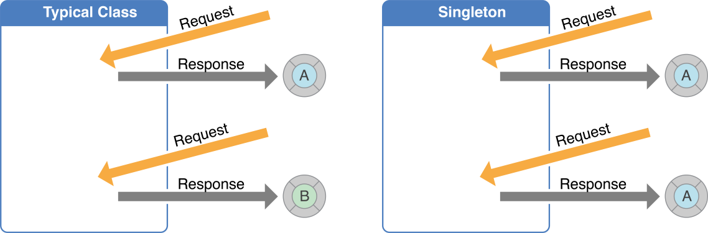

# Item 3. private 생성자나 열거 타입으로 싱글턴임을 보증하라

### 싱글턴(Singleton)

싱글턴이란 앱이 요청하는 횟수에 관계없이 동일한 인스턴스를 반환하는 클래스를 의미한다. 일반적인 클래스는 호출하는 만큼 클래스의 인스턴스를 만들 수 있도록 허용하는 반면, 싱글턴 클래스의 경우 프로세스 당 인스턴스가 하나만 존재할 수 있다. 따라서 환경설정, 네트워크 관리와 같이 앱 전체에서 공유되는 리소스 또는 서비스에 주로 사용한다. `FileManager.default`, `URLSession.shared`와 같이 실제 Cocoa 프레임워크 계층의 여러 클래스에 싱글턴 디자인 패턴이 적용되어 있다.

<br>



<br>

### 싱글턴 생성

책에서 자바를 사용한 싱글턴 생성 방식으로 `private` 생성자와 열거 타입을 소개하는데, 스위프트는 `private` 생성자를 사용하는 방식을 취한다. 스위프트의 열거 타입은 값 타입(value type)으로, 앱 전체에서 공유하여 사용하는 싱글턴의 용도에 부합하지 않고, 열거 타입 내부에 원시값으로 싱글턴 인스턴스를 갖는다면 외부에서 생성이 가능한 것이기 때문에 그 자체로 의미가 없다.  

스위프트의 싱글턴은 `static` 타입 프로퍼티와 `private` 접근 수준의 생성자를 사용하여 생성할 수 있다. `static` 타입 프로퍼티를 통한 지연 연산으로 처음 요청될 때 자신의 유일한 인스턴스를 생성하고, 생성자가 `private`으로 설정되어 외부에서 호출할 수 없기 때문에 다른 인스턴스를 생성할 수 없도록 한다.

```swift
class Singleton {
    static let shared = Singleton()

    private init() { }
}
```

<br>

### 주의할 점

싱글턴이 일반적으로 야기하는 문제는 다음과 같다.

- 싱글턴 생성 시 사용하는 `static` 타입 프로퍼티는 여러 스레드에서 동시에 접근하는 경우 한 번만 생성되는 것을 보장하지만, 동시에 참조할 경우 원치 않은 결과를 가져올 수 있으므로 코드가 스레드로부터 안전한지 고려해야 한다.
- 앱 전체에서 공유되기 때문에 싱글턴 인스턴스의 상태가 예기치 못하게 변경되면 버그가 발생할 수 있다.
- 싱글턴 인스턴스는 앱의 전체 생명주기 동안 살아있기 때문에 관리가 어렵다. 또한 싱글턴에 의존하는 코드를 테스트하기 어려운데, 이는 각 테스트 케이스에서 깨끗한 초기 상태로 시작할 수 없기 때문이다.

<br>

### 의존성 주입

용이한 테스트를 위해 싱글턴으로 접근하지 않고, 생성자에 의존성을 주입한다. 여기서 의존성이란 서비스로 사용할 수 있는 객체이고, 주입은 의존성(서비스)을 사용하려는 객체로 전달하는 것을 의미한다. 즉, 객체가 어떤 서비스를 사용할 것인지 지정하는 대신, 객체에게 어떤 서비스를 사용할 것인지를 말해주는 것이다.  

아래의 싱글턴 예시를 보면 `UserManager`의 `currentUser`가 옵셔널로 정의되어 있는 것을 확인할 수 있다. 뷰 컨트롤러가 표시되는 시점에 데이터가 실제로 존재한다는 컴파일 타임 보장이 없기 때문이다.  

의존성 주입 예시에서는 옵셔널이 아닌 `User`와 `LogOutService`를 주입한다. 결과적으로 훨씬 더 명확하고 관리하기 쉬워진다. 이 방식을 택할 경우 모델에 안전하게 의존할 수 있으며, 명확한 API를 갖는다.

- 싱글턴

  ```swift
  class ProfileViewController: UIViewController {
      private lazy var nameLabel = UILabel()
  
      override func viewDidLoad() {
          super.viewDidLoad()
          nameLabel.text = UserManager.shared.currentUser?.name // 옵셔널로 정의된 모델
      }
  
      private func handleLogOutButtonTap() {
          UserManager.shared.logOut()
      }
  }
  ```

- 의존성 주입

  ```swift
  class ProfileViewController: UIViewController {
      private let user: User
      private let logOutService: LogOutService
      private lazy var nameLabel = UILabel()
      
  		// 의존성 주입
      init(user: User, logOutService: LogOutService) {
          self.user = user
          self.logOutService = logOutService
          super.init(nibName: nil, bundle: nil)
      }
      
      override func viewDidLoad() {
          super.viewDidLoad()
          nameLabel.text = user.name
      }
      
      private func handleLogOutButtonTap() {
          logOutService.logOut()
      }
  }
  ```

<br>

### 결론

싱글턴은 Apple 자체에서도 많이 사용하는 만큼 편리하다는 장점이 있다. 어디에서나 접근이 가능하고 앱 전체에서 공유될 수 있다. 그러나 멀티 스레드 환경에서 동시에 참조한다거나, 객체 간의 명확한 분리 없이 광범위하게 사용할 경우 원치 않은 결과와 버그가 발생할 수 있다. 따라서 객체 간에 보다 잘 정의된 관계를 만들고, 의존성 주입을 사용하는 등 주의가 필요하다.